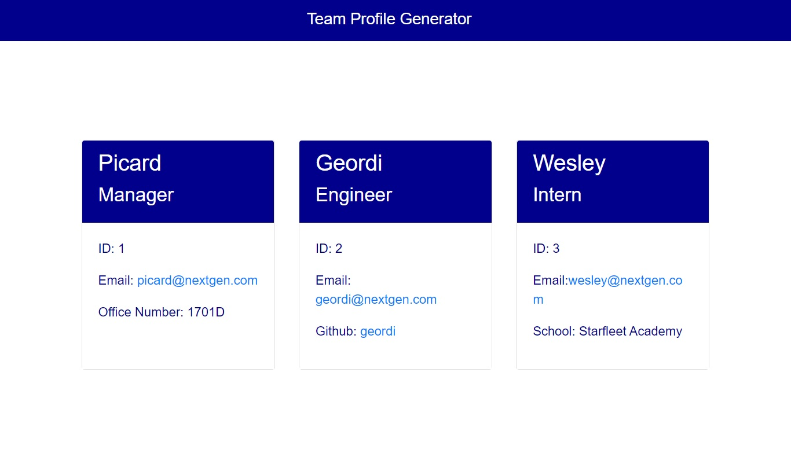

# 10-homework

## Team Profile Generator

This application allows managers or human resources personnel to generate a webpage that displays a team's basic info, enabling quick access to team members' emails and GitHub profiles.

## Mock-up

## Installation

This application requires installation of Node.js, and npm modules fs, inquirer, and jest. 

The weather dashboard is here: https://matthewestes33.github.io/teamprofilegen/

All elements of the project can be examined here: https://github.com/matthewestes33/teamprofilegen/

## Credits

Referenced documentation and tutorials:

Writing files with Node.js: https://nodejs.dev/learn/writing-files-with-nodejs

JSON.parse(): https://developer.mozilla.org/en-US/docs/Web/JavaScript/Reference/Global_Objects/JSON/parse

Template literals: https://developer.mozilla.org/en-US/docs/Web/JavaScript/Reference/Template_literals 

## Features

The user can input employee information about team members directly into the command line through a series of prompts.

The user's team compilation starts with manager questions, and presents a menu allowing input for engineer or intern information before completing the data capture. 

After completing the prompts, the user is provided with a clear message, indicating the team roster has been generated onto a formatted HTML page. 

On the HTML page, the user is provided links to each team member's email address, and every engineer's GitHub profile. 

